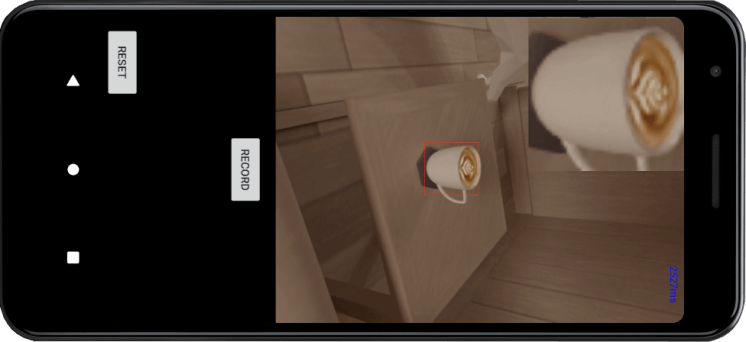
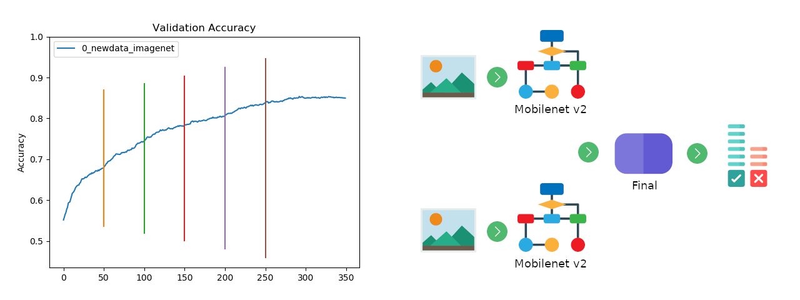

# OBJECTTracking

Short overview and discription about this repository. Main story on ...

#### Android application
In Java works with SDK wersion 28 - Android 9. Application uses tensorflow model to detect objects and allows user to record videos from camera. You can also click on object and it shows all the pictures of the same category objects in frame. Good base for developing visual machine learning solutions.  
Some errors with older Huawei phones. Optimalization posibilities: https://developers.google.com/ml-kit/ I also share compressed (quantitized) Tensorflow lite model in application resources folder. (*ssd_mobilenet_v2_quantized_coco*)

#### IOS application
IOS application. Compiled OpenCV 4.0.0 framework with trackers avaiable here (https://www.dropbox.com/s/0iqwqfjz95ehut5/opencv2.framework.zip?dl=0) add it to Frameworks in XCode project settings. You can compile framework yourself following tutorial in official page but remember to add tracking package! Framework should be in main project folder (CamTracking2), can be changed in build settings. You can also follow this tutorial https://medium.com/@yiweini/opencv-with-swift-step-by-step-c3cc1d1ee5f1 Aplication allows to test OpenCV trackers, connect to Bluetooth devices and record videos. No suport for Vision tracking so far.

Przerobic program tak zeby nie trzeba bylo laczyc sie z urzadzeniem!

#### ML
Machine learning. Folder with files for creating special object comparison net, running different nets and collecting data. Everything using Keras and Tensorflow. Useful as example to work with.
* **my_net.py**  
Using keras you can quickly create, train and deploy ready to use model of special net. It is developed for comparing the similarity of two pictures. I also share trained model on car pictures. Aproximately 5k images, 85% accuracy, 350 epochs. 

* **data.py**  
Script in python using OpenCV to create set of 2 images either similar or different from video file. All commands in terminal. It needs preprocessed video to pictures - file *process.py* uses Tensorflow model *mask_rcnn_inception_v2_coco*. Shows pictures of desired category objects from one frame and following. User needs to point wich are similar, not matching are created automaticly. First picture below.
* **webpage**  
Simple webpage that also enables data collection as above file but with progress save. Some improvements can be done. It needs preprocessed video to display pictures - file *process.py*. Webpage creates text file that should look like that 1-2,2-1 it means the same objects are 1 from first picture and 2 from second, 2 from first and 1 from second. Bad matches are created automaticly. Then we can create set of images with *webdecoder.py*. Folder structure without pictures as in repository. Second picture below.
* **run.py**  
File containing code for running different kinds of neural nets. Mask rcnn object detection, mobilenet_v2 classifier, ssd mobilenet_v2 object detector and Tensorflow Lite model.

#### Links

Tutaj bede wklejal wszystkie linki zamiast do pliku.

#### Hardware

Simple device to use with mobile phones. All parts were designed in Inventor Proffesional and then 3D printed. Lower part has special thread used in almost all photography devices. We can easily mount it to, for example tripod. Above, inside the device, is place for all the electronics. I choosed Arduino Nano, Bluetooth for connection and stepper motor. The last one was a mistake. Much better would be the brushless motor used widely in camera gimbals. Upper part has a simple mount for smartphones, wich works with almost all models.

Icons credits: https://www.flaticon.com/authors/freepik https://www.flaticon.com/authors/pause08 https://www.flaticon.com/authors/smashicons